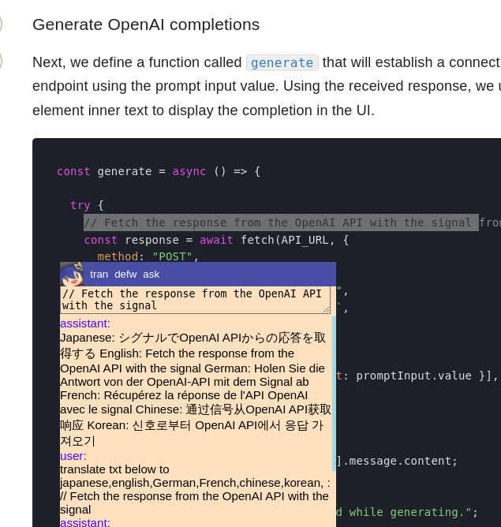

# bubuchat

Bubu is Cute browser extension powered by chatgpt,Highly customizable

try bubu quickly at 
<a href="https://lnote.suisuy.eu.org/test">test page</a>

drag bubu icon at bottom-left screen to move.
after install as broser extension,bubu will apear on any webpage,you can customize it and add more skill/prompt button as need

<strong>use bubu as translator:select some text on page then click tran button </strong>

    

# usage
current not available in chrome store or firefox,need install the extension manully:download the repo,then go to chrome extension setting,enable dev mode,then load unpacked choose the project folder;it works on android kiwi browser too 

1.after install it,bubu will apear on the webpage at left bottom,click icon to show more settings,drag it to move the window

2.set up your api url and key,there a free api server preconfigured now,but maybe unstable

3.select some txt on webpage,then click tran button,your txt will tranlate to many language,you can set your own action and more button easily,this make bubu very flexable and powerfull

4.read pdf: not work in builtin pdf read,need install pdf.js extension use pdfjs open pdf file

todo:

friendly setting ,current only advanced setting,is powerfull but not convient and risky,click bubu icon then click reset if broken

maybe add bingchat and google bard

firefox fix,bubu not work on some page when use firefox due to security policy. not easy to fixed,suggest use chrome based browser 

